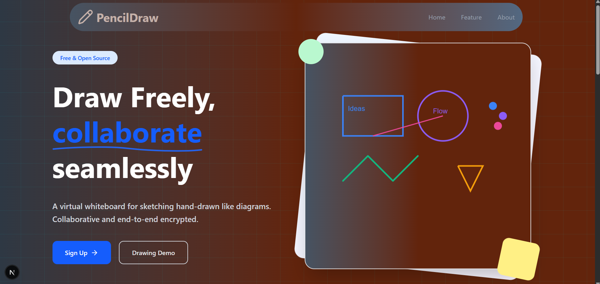
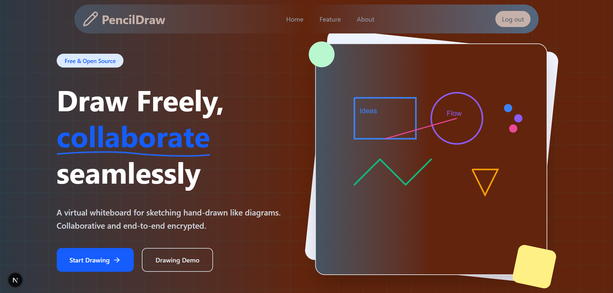
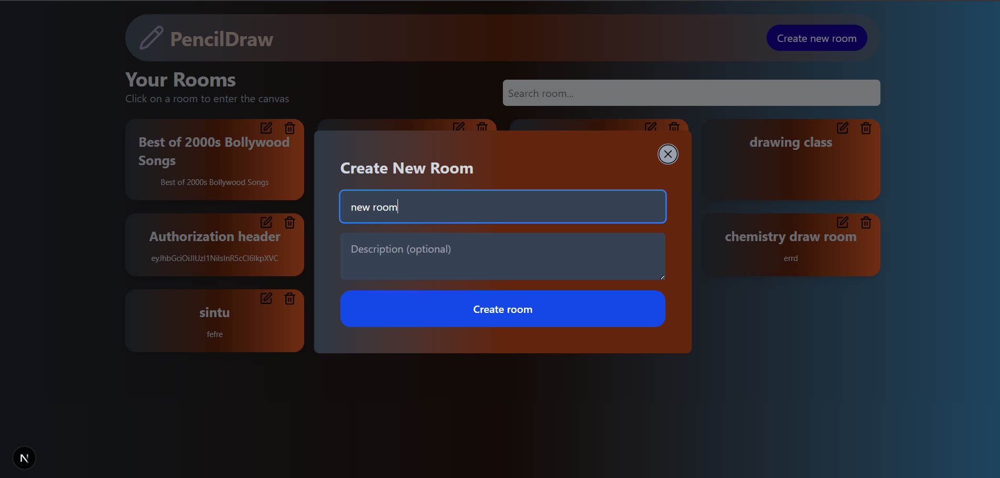
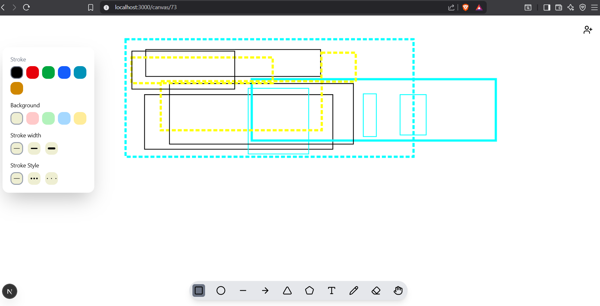

PencilDraw ✏️

PencilDraw is a real-time collaborative drawing application inspired by Excalidraw.
It allows users to draw, sketch, and collaborate on a shared canvas using WebSockets for real-time synchronization.
Built with modern full-stack technologies including Next.js, Node.js, PostgreSQL, WebSockets, and managed using Turborepo.

---

```text

🚀 Features
```text
. ✏️ Freehand drawing tool
. 🧽 Eraser tool
. 🎨 Color picker support
. 📏 Brush size customization
. ⚡ Real-time collaboration using WebSockets
. 🖼 Infinite canvas-like experience
. 🔄 Live synchronization between users
. 🗑 Clear/reset canvas
. 🧠 Optimized monorepo architecture using Turborepo


---

```text
🛠 Tech Stack
```text
➡️ Frontend

Next.js
TypeScript
Tanstack Query
Canvas
HTML Canvas API
Tailwind CSS

```text
➡️ Backend
Node.js
WebSocket Server
Database
PostgreSQL
Monorepo
Turborepo

---

```text
📂 Project Structure

```text
apps/
 ├── client          # Next.js frontend
 ├── ws-server    # WebSocket backend server
 |--- server      # node.js backend

packages/
 ├── ui           # Shared UI components
 ├── db           # Database configuration
 |-- common-data  # stored common data across application
 |-- Backend-common # user schema

 ```
 ---


⚡ How It Works

1. Login
   



2. Click on startDrawing Btn




3. create Drawing room 
   
  

4. Users join the drawing board.

  


5. Canvas events are captured in real time.
6. Drawing data is sent through WebSockets.
7. Backend broadcasts updates to connected users.
8. All users see synchronized drawings instantly.


